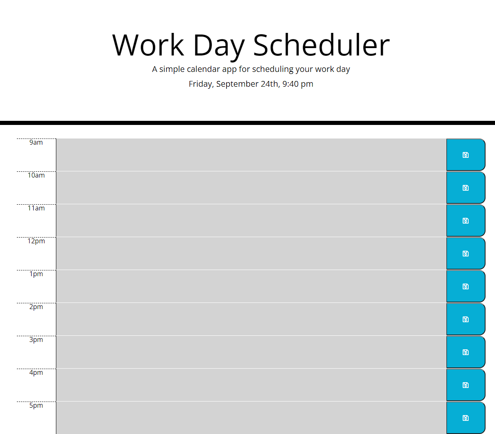

# work-day-planner
This is a planner for a 9am-5pm work day.  Text can be saved using the save button on the right side.  The text area will change colors based on if the event is in the past, present, or future.

https://lfewell.github.io/work-day-planner/